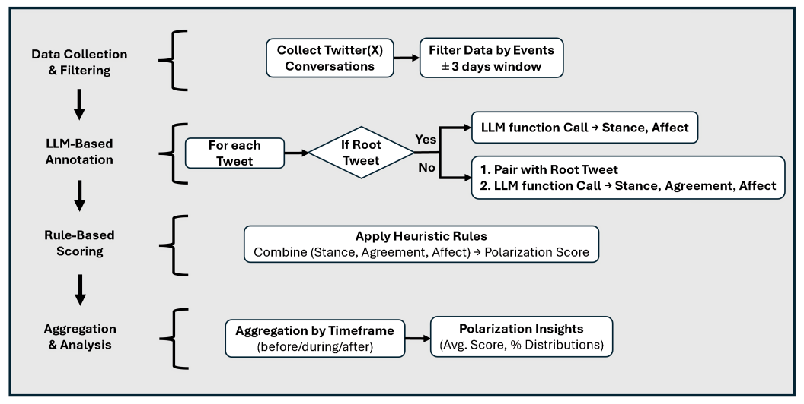
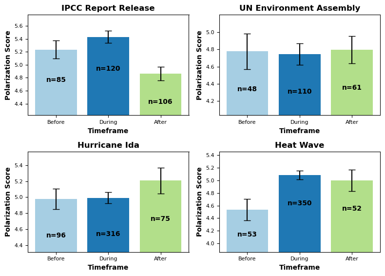
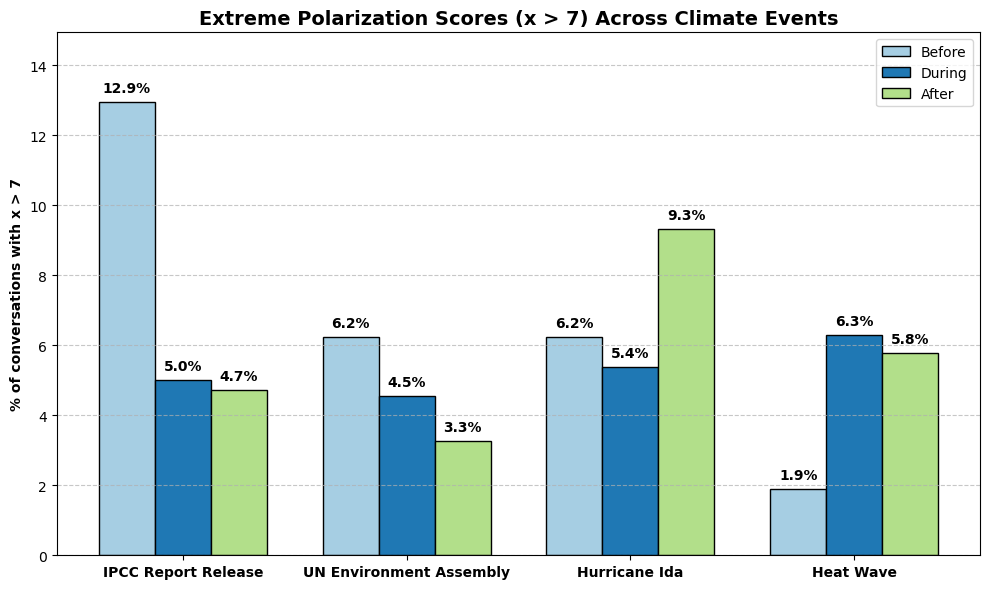
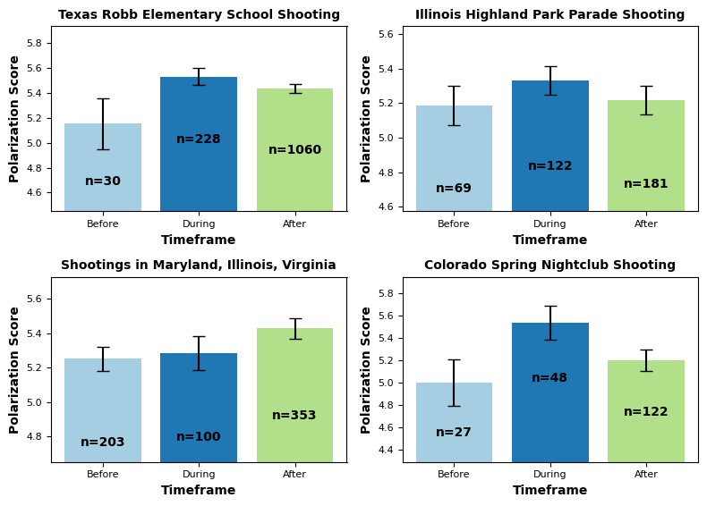
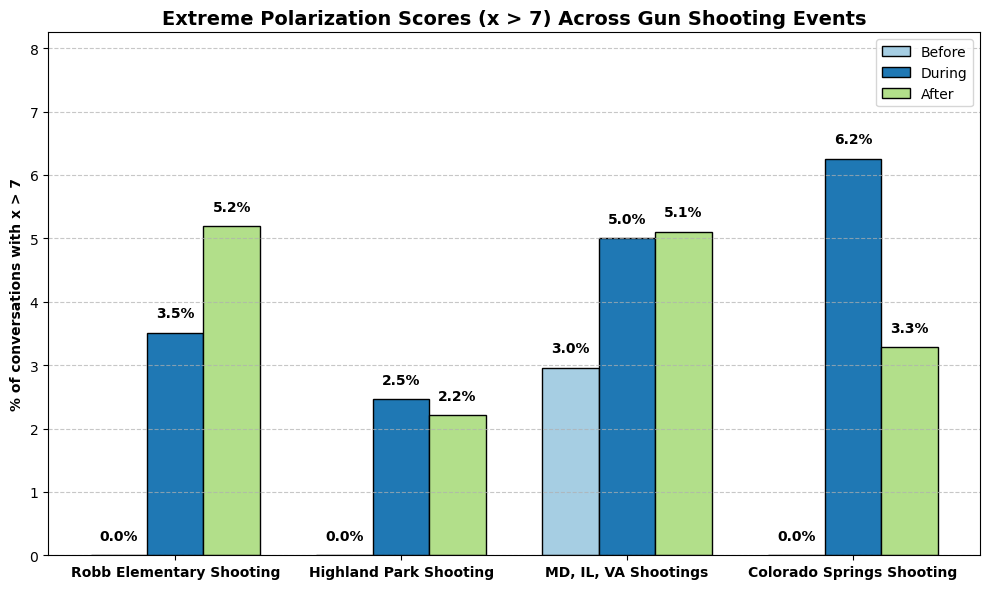

## Measuring Social Media Polarization Using Large Language Models and Heuristic Rules

This repository contains the source code and experiments for our paper **"Measuring Social Media Polarization Using Large Language Models and Heuristic Rules"**, accepted at the **International Symposium on Foundations and Applications of Big Data Analytics (FAB 2025)**, collocated with **ASONAM 2025**, Niagara Falls, Canada (Aug 25–28, 2025).

---

## Key Contributions

1. **LLM-Based Framework for Measuring Affective Polarization**  
   We propose a novel framework that uses Large Language Models (LLMs) to extract stance, affective tone, and agreement patterns from social media conversations on divisive issues such as climate change and gun control.

2. **Interpretable Rule-Based Scoring System**  
   Unlike traditional sentiment or network-based approaches, our method introduces a **heuristic scoring system** to measure affective polarization - even in **short or single-interaction conversations** - by evaluating stance alignment, emotional intensity, and disagreement dynamics.

3. **Discovery of Event-Driven Polarization Patterns**  
   Through large-scale empirical analysis, we uncover two distinct polarization trends:  
   - *Anticipatory Polarization*: Elevated polarization leading up to publicized events  
   - *Reactive Polarization*: Sudden spikes in polarization immediately following impactful events

4. **Scalable and Transparent AI for Social Impact**  
   Our methodology offers a scalable, explainable alternative to black-box classifiers and is suitable for both small and large-scale discourse analysis, contributing to the broader goal of interpretable AI in social systems.

---

## Visualizations

1. **LLM-Based Pipeline Overview**  
     
   *Fig 1.* End-to-end pipeline for data collection, LLM-based annotation, heuristic scoring, and aggregation for polarization analysis.

2. **Climate Change Events – Affective Polarization Scores**  
     
   *Fig 2.* Mean polarization scores before, during, and after four climate-related events. Bars show mean ± SEM. "n" indicates number of conversations.

3. **Climate Change Events – Extreme Polarization Rates**  
     
   *Fig 3.* Percent of conversations with extreme polarization (score > 7) across timeframes for the same events.

4. **Gun Control Events – Affective Polarization Scores**  
     
   *Fig 4.* Average polarization scores before, during, and after four gun control-related events.

5. **Gun Control Events – Extreme Polarization Rates**  
     
   *Fig 5.* Percent of conversations with extreme polarization scores (x > 7) for the same set of gun control events.

---

## Files and Folders

- **\*.ipynb**, **\*.py**: notebooks and python scripts showcasing LLM prompting and the workflow pipeline example using Llama3.1 70b model.

---

For more details, please refer to the final paper (link will be updated upon publication).  
If you find this work useful, please star the repository and cite the paper (also feel free to get in touch for collaboration).

